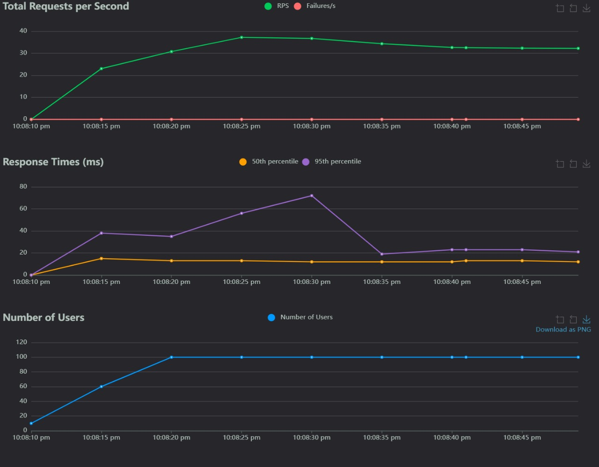
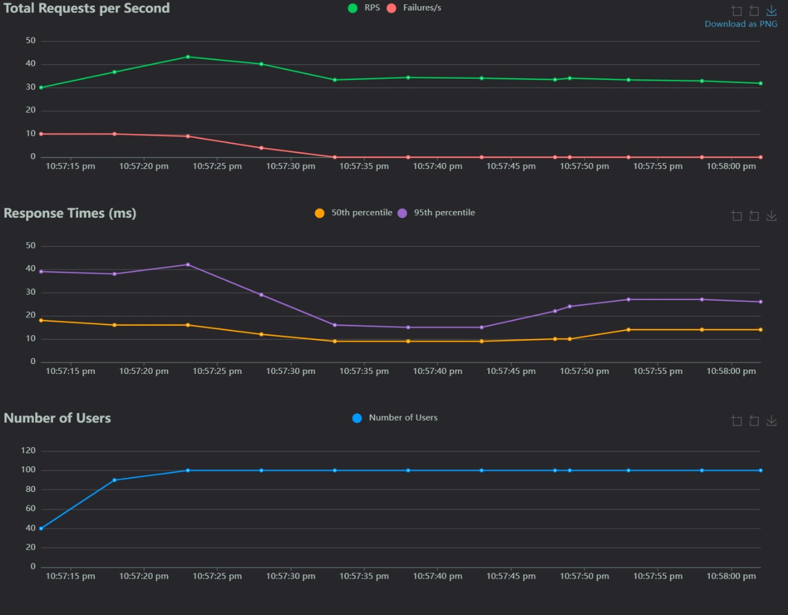

# 🚀 Performance Testing with Locust

---

## 📋 Test Setup
We performed load testing on our *Semantic Search API* using *Locust FastAPI*. The setup details are as follows:

- **Target Endpoint:** `/search`
- **User Count:** 100 (simulated concurrent users)
- **Spawn Rate:** 10 users per second
- **Test Duration:** 39 seconds

---

## 📊 Results

### FastAPI Results
| Metric                | Value            |
|-----------------------|------------------|
| *Total Requests*     | 1,091             |
| *Failures*            | 0                |
| *Median Response Time*| 13 ms             |
| *95th Percentile*     | 39 ms             |
| *Average RPS*         | 32.2 requests/s   |

### BentoML Results
| Metric                | Value            |
|-----------------------|------------------|
| *Total Requests*     | 745               |
| *Failures*            | 2                |
| *Median Response Time*| 24 ms             |
| *95th Percentile*     | 57 ms             |
| *Average RPS*         | 24.8 requests/s   |

---

## 📈 Charts 
### FASTAPI

### BentoML

---

## 📈 Detailed Results

### FastAPI Detailed Results
| *Timestamp* | *Requests* | *Failures* | *Median Response Time (ms)* | *95th Percentile (ms)* |
|:---------------|:--------------|:--------------|:-----------------------------|:-------------------------|
| 00:01           | 37             | 0              | 13                          | 56                       |
| 00:02           | 36             | 0              | 12                          | 72                       |
| 00:03           | 34             | 0              | 12                          | 19                       |
| 00:04           | 32             | 0              | 12                          | 23                       |
| 00:05           | 32             | 0              | 12                          | 21                       |

### BentoML Detailed Results
| *Timestamp* | *Requests* | *Failures* | *Median Response Time (ms)* | *95th Percentile (ms)* |
|:---------------|:--------------|:--------------|:-----------------------------|:-------------------------|
| 00:01           | 25             | 0              | 22                          | 49                       |
| 00:02           | 28             | 1              | 24                          | 57                       |
| 00:03           | 24             | 0              | 25                          | 50                       |
| 00:04           | 27             | 0              | 23                          | 45                       |
| 00:05           | 26             | 1              | 24                          | 46                       |

---
📅 **Generated on:** March 20, 2025  
🛠 **Tested with:** Locust FastAPI  